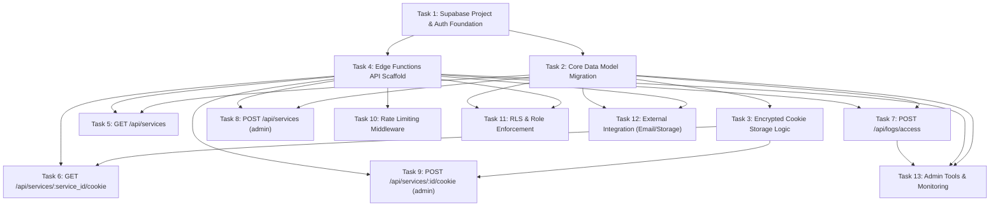

# SessionShare Backend Implementation Plan

> **For agentic workers:** REQUIRED SUB-SKILL: Use superpowers:subagent-driven-development (recommended) or superpowers:executing-plans to implement this plan task-by-task. Steps use checkbox (`- [ ]`) syntax for tracking.

**Goal:** Build the complete SessionShare backend — a serverless Supabase infrastructure that powers a Chrome extension for secure session cookie sharing across premium web services (ChatGPT, Canva, Netflix, etc.).

**Architecture:** Serverless backend using Supabase Edge Functions (Deno/TypeScript) for API, Supabase Postgres with Row-Level Security for data, Supabase Auth for JWT session management, and Supabase Storage for service icons. All cookie payloads are AES-256 encrypted at rest. The system enforces role-based access (admin/member) via both RLS policies and API middleware.

**Tech Stack:** Supabase (Auth, Database, Edge Functions, Storage), TypeScript/Deno, AES-256-GCM encryption (Web Crypto API), PostgreSQL, JWT

---

## DAG Dependency Graph



**Execution Order (respecting DAG dependencies):**
- **Layer 0:** Task 1 (no dependencies)
- **Layer 1:** Task 2, Task 4 (depend on Task 1)
- **Layer 2:** Task 3, Task 5, Task 7, Task 8, Task 10, Task 11, Task 12 (depend on Tasks 1-4)
- **Layer 3:** Task 6, Task 9, Task 13 (depend on encryption + endpoints)

---

## File Structure

```
SessionShare/
├── supabase/
│   ├── config.toml                          # Supabase local config
│   ├── seed.sql                             # Seed data for dev
│   ├── migrations/
│   │   ├── 00001_create_users_table.sql
│   │   ├── 00002_create_services_table.sql
│   │   ├── 00003_create_shared_session_cookies_table.sql
│   │   ├── 00004_create_cookie_access_logs_table.sql
│   │   ├── 00005_create_rate_limit_table.sql
│   │   └── 00006_rls_policies.sql
│   └── functions/
│       ├── _shared/
│       │   ├── cors.ts                      # CORS headers helper
│       │   ├── auth.ts                      # JWT validation + role extraction
│       │   ├── errors.ts                    # Standardized error responses
│       │   ├── rate-limit.ts                # Rate limiting logic
│       │   ├── crypto.ts                    # AES-256-GCM encrypt/decrypt
│       │   ├── supabase-client.ts           # Supabase client factory
│       │   └── types.ts                     # Shared TypeScript types
│       ├── services/
│       │   └── index.ts                     # GET /api/services, POST /api/services
│       ├── service-cookie/
│       │   └── index.ts                     # GET /api/services/:id/cookie, POST /api/services/:id/cookie
│       ├── logs-access/
│       │   └── index.ts                     # POST /api/logs/access
│       └── admin-dashboard/
│           └── index.ts                     # Admin stats/monitoring endpoint
├── tests/
│   ├── crypto.test.ts                       # Encryption unit tests
│   ├── auth.test.ts                         # Auth middleware tests
│   ├── rate-limit.test.ts                   # Rate limiting tests
│   ├── services.test.ts                     # Services endpoint tests
│   ├── service-cookie.test.ts               # Cookie endpoint tests
│   ├── logs-access.test.ts                  # Access logging tests
│   └── admin.test.ts                        # Admin endpoint tests
├── .env.example                             # Template for env vars
├── .env.local                               # Local dev env vars (gitignored)
├── .gitignore
├── README.md
└── docs/
    └── superpowers/
        └── plans/
            └── 2026-06-12-sessionshare-backend.md  # This plan
```

---

## Task 1: Supabase Project & Auth Foundation

**Dependencies:** None (root node)

**Files:**
- Create: `supabase/config.toml`
- Create: `.env.example`
- Create: `.env.local`
- Create: `.gitignore`
- Create: `README.md`

- [ ] **Step 1: Install Supabase CLI**

```bash
npm install -g supabase
```

Expected: `supabase` command available globally.

- [ ] **Step 2: Initialize Supabase project**

```bash
cd "D:\Private\Coding Project\SessionShare"
supabase init
```

Expected: Creates `supabase/` directory with `config.toml`.

- [ ] **Step 3: Create .env.example with all required vars**

Create file `.env.example`:

```env
# Supabase (public)
SUPABASE_URL=http://localhost:54321
SUPABASE_ANON_KEY=your-anon-key-here
SUPABASE_SERVICE_ROLE_KEY=your-service-role-key-here

# Encryption (secret - generate with: openssl rand -hex 32)
ENCRYPTION_KEY=your-256-bit-hex-key-here

# Optional integrations
SENDGRID_API_KEY=
SENTRY_DSN=
```

- [ ] **Step 4: Create .env.local for local dev**

Copy `.env.example` to `.env.local` and fill in the local Supabase keys (obtained after `supabase start`).

- [ ] **Step 5: Create .gitignore**

Create file `.gitignore`:

```gitignore
# Environment
.env.local
.env.production
.env.staging

# Supabase
supabase/.temp/
supabase/.branches/

# Node
node_modules/
dist/

# OS
.DS_Store
Thumbs.db

# IDE
.idea/
.vscode/
*.swp
```

- [ ] **Step 6: Create README.md**

Create file `README.md`:

```markdown
# SessionShare Backend

Secure backend infrastructure for the SessionShare Chrome extension.
Powered by Supabase Edge Functions, Postgres, and Auth.

## Setup

1. Install Supabase CLI: `npm install -g supabase`
2. Copy `.env.example` to `.env.local` and fill in values
3. Start local Supabase: `supabase start`
4. Run migrations: `supabase db push`
5. Deploy functions: `supabase functions deploy`

## Architecture

- **API:** Supabase Edge Functions (Deno/TypeScript)
- **Database:** PostgreSQL with Row-Level Security
- **Auth:** Supabase Auth (JWT)
- **Encryption:** AES-256-GCM for cookie payloads

## Environment Variables

See `.env.example` for all required configuration.
```

- [ ] **Step 7: Start local Supabase and capture keys**

```bash
supabase start
```

Expected output includes `API URL`, `anon key`, `service_role key`. Copy these into `.env.local`.

- [ ] **Step 8: Verify Auth is working**

```bash
supabase status
```

Expected: All services (API, DB, Auth, Storage) show as running.

- [ ] **Step 9: Commit**

```bash
git init
git add .
git commit -m "feat: initialize Supabase project with auth foundation"
```

---

## Task 2: Core Data Model Migration

**Dependencies:** Task 1

**Files:**
- Create: `supabase/migrations/00001_create_users_table.sql`
- Create: `supabase/migrations/00002_create_services_table.sql`
- Create: `supabase/migrations/00003_create_shared_session_cookies_table.sql`
- Create: `supabase/migrations/00004_create_cookie_access_logs_table.sql`
- Create: `supabase/seed.sql`

- [ ] **Step 1: Create users profile table migration**

Create file `supabase/migrations/00001_create_users_table.sql`:

```sql
-- Users profile table extending Supabase Auth
-- Stores role information for RBAC

CREATE TYPE user_role AS ENUM ('admin', 'member');

CREATE TABLE public.users (
  id UUID PRIMARY KEY REFERENCES auth.users(id) ON DELETE CASCADE,
  email TEXT UNIQUE NOT NULL,
  role user_role NOT NULL DEFAULT 'member',
  created_at TIMESTAMPTZ NOT NULL DEFAULT now()
);

-- Index for email lookups
CREATE INDEX idx_users_email ON public.users(email);

-- Enable RLS (policies added in Task 11)
ALTER TABLE public.users ENABLE ROW LEVEL SECURITY;

-- Auto-create user profile on signup via trigger
CREATE OR REPLACE FUNCTION public.handle_new_user()
RETURNS TRIGGER AS $$
BEGIN
  INSERT INTO public.users (id, email, role)
  VALUES (NEW.id, NEW.email, 'member');
  RETURN NEW;
END;
$$ LANGUAGE plpgsql SECURITY DEFINER;

CREATE TRIGGER on_auth_user_created
  AFTER INSERT ON auth.users
  FOR EACH ROW
  EXECUTE FUNCTION public.handle_new_user();

COMMENT ON TABLE public.users IS 'User profiles with role-based access control';
COMMENT ON COLUMN public.users.role IS 'admin: full access, member: read-only cookie access';
```

- [ ] **Step 2: Run migration and verify users table**

```bash
supabase db push
```

Then verify:

```bash
supabase db reset
```

Expected: Migration applies without errors. Table `public.users` exists with columns `id`, `email`, `role`, `created_at`.

- [ ] **Step 3: Create services table migration**

Create file `supabase/migrations/00002_create_services_table.sql`:

```sql
-- Services table: premium web services available for cookie sharing

CREATE TABLE public.services (
  id UUID PRIMARY KEY DEFAULT gen_random_uuid(),
  name TEXT UNIQUE NOT NULL,
  website_url TEXT NOT NULL,
  icon_url TEXT,
  created_at TIMESTAMPTZ NOT NULL DEFAULT now(),
  updated_at TIMESTAMPTZ NOT NULL DEFAULT now()
);

-- Index for name lookups
CREATE INDEX idx_services_name ON public.services(name);

-- Enable RLS (policies added in Task 11)
ALTER TABLE public.services ENABLE ROW LEVEL SECURITY;

-- Auto-update updated_at timestamp
CREATE OR REPLACE FUNCTION public.update_updated_at()
RETURNS TRIGGER AS $$
BEGIN
  NEW.updated_at = now();
  RETURN NEW;
END;
$$ LANGUAGE plpgsql;

CREATE TRIGGER services_updated_at
  BEFORE UPDATE ON public.services
  FOR EACH ROW
  EXECUTE FUNCTION public.update_updated_at();

COMMENT ON TABLE public.services IS 'Premium web services available for session cookie sharing';
```

- [ ] **Step 4: Run migration and verify services table**

```bash
supabase db push
```

Expected: Table `public.services` exists with columns `id`, `name`, `website_url`, `icon_url`, `created_at`, `updated_at`.

- [ ] **Step 5: Create shared_session_cookies table migration**

Create file `supabase/migrations/00003_create_shared_session_cookies_table.sql`:

```sql
-- Shared session cookies: AES-256 encrypted cookie payloads per service

CREATE TABLE public.shared_session_cookies (
  id UUID PRIMARY KEY DEFAULT gen_random_uuid(),
  service_id UUID NOT NULL REFERENCES public.services(id) ON DELETE CASCADE,
  encrypted_cookie_data TEXT NOT NULL,
  generated_at TIMESTAMPTZ NOT NULL DEFAULT now(),
  expires_at TIMESTAMPTZ NOT NULL,
  is_active BOOLEAN NOT NULL DEFAULT true
);

-- Composite index for fetching active cookie by service
CREATE INDEX idx_shared_cookies_service_active
  ON public.shared_session_cookies(service_id, is_active, generated_at DESC);

-- Index for expiry cleanup
CREATE INDEX idx_shared_cookies_expires
  ON public.shared_session_cookies(expires_at);

-- Enable RLS (policies added in Task 11)
ALTER TABLE public.shared_session_cookies ENABLE ROW LEVEL SECURITY;

COMMENT ON TABLE public.shared_session_cookies IS 'AES-256 encrypted session cookie payloads with rotation support';
COMMENT ON COLUMN public.shared_session_cookies.encrypted_cookie_data IS 'Base64-encoded AES-256-GCM encrypted JSON cookie data';
COMMENT ON COLUMN public.shared_session_cookies.is_active IS 'Only one active cookie per service at a time';
```

- [ ] **Step 6: Run migration and verify shared_session_cookies table**

```bash
supabase db push
```

Expected: Table `public.shared_session_cookies` exists with proper foreign key to `services`.

- [ ] **Step 7: Create cookie_access_logs table migration**

Create file `supabase/migrations/00004_create_cookie_access_logs_table.sql`:

```sql
-- Cookie access logs: audit trail for all cookie access events

CREATE TABLE public.cookie_access_logs (
  id UUID PRIMARY KEY DEFAULT gen_random_uuid(),
  user_id UUID NOT NULL REFERENCES public.users(id) ON DELETE CASCADE,
  service_id UUID NOT NULL REFERENCES public.services(id) ON DELETE CASCADE,
  action TEXT NOT NULL CHECK (action IN ('access', 'inject', 'export', 'view')),
  ip_address INET,
  user_agent TEXT,
  created_at TIMESTAMPTZ NOT NULL DEFAULT now()
);

-- Index for user activity lookups
CREATE INDEX idx_access_logs_user ON public.cookie_access_logs(user_id, created_at DESC);

-- Index for service activity lookups
CREATE INDEX idx_access_logs_service ON public.cookie_access_logs(service_id, created_at DESC);

-- Index for time-range queries (admin reporting)
CREATE INDEX idx_access_logs_created ON public.cookie_access_logs(created_at DESC);

-- Enable RLS (policies added in Task 11)
ALTER TABLE public.cookie_access_logs ENABLE ROW LEVEL SECURITY;

COMMENT ON TABLE public.cookie_access_logs IS 'Audit trail for all cookie access and injection events';
```

- [ ] **Step 8: Run migration and verify cookie_access_logs table**

```bash
supabase db push
```

Expected: Table `public.cookie_access_logs` exists with foreign keys to `users` and `services`.

- [ ] **Step 9: Create seed data for development**

Create file `supabase/seed.sql`:

```sql
-- Seed data for local development
-- NOTE: Auth users must be created via Supabase Auth API, not directly in DB

-- Sample services
INSERT INTO public.services (id, name, website_url, icon_url) VALUES
  ('a1b2c3d4-e5f6-7890-abcd-ef1234567890', 'ChatGPT', 'https://chat.openai.com', NULL),
  ('b2c3d4e5-f6a7-8901-bcde-f12345678901', 'Canva', 'https://www.canva.com', NULL),
  ('c3d4e5f6-a7b8-9012-cdef-123456789012', 'Netflix', 'https://www.netflix.com', NULL),
  ('d4e5f6a7-b8c9-0123-defa-234567890123', 'Spotify', 'https://www.spotify.com', NULL),
  ('e5f6a7b8-c9d0-1234-efab-345678901234', 'Adobe Creative Cloud', 'https://www.adobe.com', NULL)
ON CONFLICT (name) DO NOTHING;
```

- [ ] **Step 10: Run seed and verify data**

```bash
supabase db reset
```

Expected: All tables created, seed data inserted. Verify with:

```bash
supabase db query "SELECT name, website_url FROM public.services;"
```

Expected output: 5 rows of services.

- [ ] **Step 11: Commit**

```bash
git add supabase/migrations/ supabase/seed.sql
git commit -m "feat: add core data model migrations (users, services, cookies, logs)"
```

---

## Task 3: Encrypted Cookie Storage Logic

**Dependencies:** Task 2

**Files:**
- Create: `supabase/functions/_shared/crypto.ts`
- Create: `supabase/functions/_shared/types.ts`
- Create: `tests/crypto.test.ts`

- [ ] **Step 1: Write the failing test for encryption**

Create file `tests/crypto.test.ts`:

```typescript
import { assertEquals, assertNotEquals, assertRejects } from "https://deno.land/std@0.208.0/assert/mod.ts";

// We'll import from the module once it exists
// For now, define expected interface
Deno.test("encrypt returns base64 string different from plaintext", async () => {
  const { encrypt } = await import("../supabase/functions/_shared/crypto.ts");
  const key = "a".repeat(64); // 256-bit hex key
  const plaintext = JSON.stringify([{ name: "session", value: "abc123" }]);

  const encrypted = await encrypt(plaintext, key);

  assertNotEquals(encrypted, plaintext);
  assertEquals(typeof encrypted, "string");
  // Base64 check: should only contain valid base64 chars
  assertEquals(/^[A-Za-z0-9+/=]+$/.test(encrypted), true);
});

Deno.test("decrypt recovers original plaintext", async () => {
  const { encrypt, decrypt } = await import("../supabase/functions/_shared/crypto.ts");
  const key = "b".repeat(64);
  const plaintext = JSON.stringify([
    { name: "session_token", value: "tok_abc123", domain: ".example.com" },
    { name: "csrf", value: "csrf_xyz", domain: ".example.com" },
  ]);

  const encrypted = await encrypt(plaintext, key);
  const decrypted = await decrypt(encrypted, key);

  assertEquals(decrypted, plaintext);
});

Deno.test("decrypt with wrong key throws error", async () => {
  const { encrypt, decrypt } = await import("../supabase/functions/_shared/crypto.ts");
  const correctKey = "c".repeat(64);
  const wrongKey = "d".repeat(64);
  const plaintext = "secret data";

  const encrypted = await encrypt(plaintext, correctKey);

  await assertRejects(
    () => decrypt(encrypted, wrongKey),
    Error,
    "Decryption failed",
  );
});

Deno.test("decrypt with tampered ciphertext throws error", async () => {
  const { encrypt, decrypt } = await import("../supabase/functions/_shared/crypto.ts");
  const key = "e".repeat(64);
  const plaintext = "secret data";

  const encrypted = await encrypt(plaintext, key);
  // Tamper with the ciphertext
  const tampered = encrypted.slice(0, -4) + "AAAA";

  await assertRejects(
    () => decrypt(tampered, key),
    Error,
    "Decryption failed",
  );
});

Deno.test("each encryption produces different ciphertext (unique IV)", async () => {
  const { encrypt } = await import("../supabase/functions/_shared/crypto.ts");
  const key = "f".repeat(64);
  const plaintext = "same data";

  const encrypted1 = await encrypt(plaintext, key);
  const encrypted2 = await encrypt(plaintext, key);

  assertNotEquals(encrypted1, encrypted2);
});

Deno.test("encrypt rejects invalid key length", async () => {
  const { encrypt } = await import("../supabase/functions/_shared/crypto.ts");
  const shortKey = "abcd"; // Too short

  await assertRejects(
    () => encrypt("data", shortKey),
    Error,
    "Invalid encryption key",
  );
});
```

- [ ] **Step 2: Run tests to verify they fail**

```bash
deno test tests/crypto.test.ts --allow-read --allow-net
```

Expected: FAIL — module `crypto.ts` does not exist yet.

- [ ] **Step 3: Create shared types**

Create file `supabase/functions/_shared/types.ts`:

```typescript
// === Database Entity Types ===

export type UserRole = "admin" | "member";

export interface User {
  id: string;
  email: string;
  role: UserRole;
  created_at: string;
}

export interface Service {
  id: string;
  name: string;
  website_url: string;
  icon_url: string | null;
  created_at: string;
  updated_at: string;
}

export interface SharedSessionCookie {
  id: string;
  service_id: string;
  encrypted_cookie_data: string;
  generated_at: string;
  expires_at: string;
  is_active: boolean;
}

export interface CookieAccessLog {
  id: string;
  user_id: string;
  service_id: string;
  action: "access" | "inject" | "export" | "view";
  ip_address: string | null;
  user_agent: string | null;
  created_at: string;
}

// === API Request/Response Types ===

export interface ApiError {
  error: {
    code: string;
    message: string;
  };
}

export interface ServicesListResponse {
  services: Omit<Service, "created_at" | "updated_at">[];
}

export interface ServiceDetailResponse {
  id: string;
  name: string;
  website_url: string;
  icon_url: string | null;
}

export interface CookieResponse {
  encrypted_cookie_data: string;
  expires_at: string;
}

export interface AccessLogRequest {
  service_id: string;
  action: "access" | "inject" | "export" | "view";
}

export interface CreateServiceRequest {
  name: string;
  website_url: string;
  icon_url?: string;
}

export interface UploadCookieRequest {
  encrypted_cookie_data: string;
  expires_at: string;
}

// === Auth Types ===

export interface AuthenticatedUser {
  id: string;
  email: string;
  role: UserRole;
}
```

- [ ] **Step 4: Implement AES-256-GCM encryption module**

Create file `supabase/functions/_shared/crypto.ts`:

```typescript
/**
 * AES-256-GCM Encryption Module
 *
 * Uses Web Crypto API (available in Deno) for server-side
 * encryption/decryption of cookie payloads.
 *
 * Format: base64(IV + ciphertext + authTag)
 * - IV: 12 bytes (96 bits) — randomly generated per encryption
 * - Ciphertext: variable length
 * - Auth Tag: 16 bytes (128 bits) — appended by GCM mode
 */

const IV_LENGTH = 12; // 96 bits for GCM
const KEY_LENGTH = 32; // 256 bits

/**
 * Convert a hex string to a Uint8Array
 */
function hexToBytes(hex: string): Uint8Array {
  const bytes = new Uint8Array(hex.length / 2);
  for (let i = 0; i < hex.length; i += 2) {
    bytes[i / 2] = parseInt(hex.substring(i, i + 2), 16);
  }
  return bytes;
}

/**
 * Import a hex-encoded 256-bit key as a CryptoKey
 */
async function importKey(hexKey: string): Promise<CryptoKey> {
  if (!hexKey || hexKey.length !== KEY_LENGTH * 2) {
    throw new Error(
      `Invalid encryption key: expected ${KEY_LENGTH * 2} hex characters, got ${hexKey?.length ?? 0}`,
    );
  }

  const keyBytes = hexToBytes(hexKey);

  return crypto.subtle.importKey(
    "raw",
    keyBytes,
    { name: "AES-GCM" },
    false,
    ["encrypt", "decrypt"],
  );
}

/**
 * Encrypt plaintext using AES-256-GCM
 *
 * @param plaintext - The string to encrypt
 * @param hexKey - 64-character hex string (256-bit key)
 * @returns Base64-encoded string containing IV + ciphertext + authTag
 */
export async function encrypt(plaintext: string, hexKey: string): Promise<string> {
  const key = await importKey(hexKey);

  // Generate random IV for each encryption (critical for GCM security)
  const iv = crypto.getRandomValues(new Uint8Array(IV_LENGTH));

  const encodedPlaintext = new TextEncoder().encode(plaintext);

  const ciphertext = await crypto.subtle.encrypt(
    { name: "AES-GCM", iv },
    key,
    encodedPlaintext,
  );

  // Combine IV + ciphertext (authTag is appended by GCM)
  const combined = new Uint8Array(iv.length + ciphertext.byteLength);
  combined.set(iv);
  combined.set(new Uint8Array(ciphertext), iv.length);

  // Encode to base64
  return btoa(String.fromCharCode(...combined));
}

/**
 * Decrypt an AES-256-GCM encrypted payload
 *
 * @param encryptedBase64 - Base64-encoded string from encrypt()
 * @param hexKey - 64-character hex string (256-bit key)
 * @returns Original plaintext string
 * @throws Error if decryption fails (wrong key, tampered data, etc.)
 */
export async function decrypt(encryptedBase64: string, hexKey: string): Promise<string> {
  const key = await importKey(hexKey);

  // Decode base64
  let combined: Uint8Array;
  try {
    const binaryString = atob(encryptedBase64);
    combined = new Uint8Array(binaryString.length);
    for (let i = 0; i < binaryString.length; i++) {
      combined[i] = binaryString.charCodeAt(i);
    }
  } catch {
    throw new Error("Decryption failed: invalid base64 input");
  }

  if (combined.length < IV_LENGTH + 1) {
    throw new Error("Decryption failed: ciphertext too short");
  }

  // Extract IV and ciphertext
  const iv = combined.slice(0, IV_LENGTH);
  const ciphertext = combined.slice(IV_LENGTH);

  try {
    const decrypted = await crypto.subtle.decrypt(
      { name: "AES-GCM", iv },
      key,
      ciphertext,
    );

    return new TextDecoder().decode(decrypted);
  } catch {
    throw new Error("Decryption failed: invalid key or tampered data");
  }
}
```

- [ ] **Step 5: Run tests to verify they pass**

```bash
deno test tests/crypto.test.ts --allow-read --allow-net
```

Expected: All 6 tests PASS.

- [ ] **Step 6: Commit**

```bash
git add supabase/functions/_shared/crypto.ts supabase/functions/_shared/types.ts tests/crypto.test.ts
git commit -m "feat: add AES-256-GCM encryption module with tests"
```

---

## Task 4: Edge Functions API Scaffold

**Dependencies:** Task 1

**Files:**
- Create: `supabase/functions/_shared/cors.ts`
- Create: `supabase/functions/_shared/auth.ts`
- Create: `supabase/functions/_shared/errors.ts`
- Create: `supabase/functions/_shared/supabase-client.ts`
- Create: `tests/auth.test.ts`

- [ ] **Step 1: Write the failing test for auth middleware**

Create file `tests/auth.test.ts`:

```typescript
import { assertEquals } from "https://deno.land/std@0.208.0/assert/mod.ts";

Deno.test("createErrorResponse returns proper error format", async () => {
  const { createErrorResponse } = await import("../supabase/functions/_shared/errors.ts");

  const response = createErrorResponse(401, "UNAUTHORIZED", "Missing or invalid token");

  assertEquals(response.status, 401);
  const body = await response.json();
  assertEquals(body.error.code, "UNAUTHORIZED");
  assertEquals(body.error.message, "Missing or invalid token");
});

Deno.test("createErrorResponse includes CORS headers", async () => {
  const { createErrorResponse } = await import("../supabase/functions/_shared/errors.ts");

  const response = createErrorResponse(403, "FORBIDDEN", "Admin only");

  assertEquals(response.headers.get("Access-Control-Allow-Origin"), "*");
});

Deno.test("corsHeaders returns proper headers for preflight", async () => {
  const { corsHeaders } = await import("../supabase/functions/_shared/cors.ts");

  assertEquals(typeof corsHeaders["Access-Control-Allow-Origin"], "string");
  assertEquals(typeof corsHeaders["Access-Control-Allow-Headers"], "string");
  assertEquals(typeof corsHeaders["Access-Control-Allow-Methods"], "string");
});
```

- [ ] **Step 2: Run tests to verify they fail**

```bash
deno test tests/auth.test.ts --allow-read --allow-net --allow-env
```

Expected: FAIL — modules do not exist yet.

- [ ] **Step 3: Create CORS headers helper**

Create file `supabase/functions/_shared/cors.ts`:

```typescript
/**
 * CORS Headers for Edge Functions
 *
 * Applied to all responses. The Chrome extension
 * needs cross-origin access to these endpoints.
 */
export const corsHeaders: Record<string, string> = {
  "Access-Control-Allow-Origin": "*",
  "Access-Control-Allow-Headers":
    "authorization, x-client-info, apikey, content-type",
  "Access-Control-Allow-Methods": "GET, POST, PUT, DELETE, OPTIONS",
};

/**
 * Handle CORS preflight (OPTIONS) requests
 */
export function handleCors(req: Request): Response | null {
  if (req.method === "OPTIONS") {
    return new Response("ok", { headers: corsHeaders });
  }
  return null;
}
```

- [ ] **Step 4: Create standardized error responses**

Create file `supabase/functions/_shared/errors.ts`:

```typescript
import { corsHeaders } from "./cors.ts";

/**
 * Create a standardized JSON error response
 *
 * All API errors follow the format:
 * { error: { code: string, message: string } }
 */
export function createErrorResponse(
  status: number,
  code: string,
  message: string,
): Response {
  return new Response(
    JSON.stringify({
      error: { code, message },
    }),
    {
      status,
      headers: {
        ...corsHeaders,
        "Content-Type": "application/json",
      },
    },
  );
}

/**
 * Create a standardized JSON success response
 */
export function createJsonResponse(
  data: unknown,
  status = 200,
): Response {
  return new Response(
    JSON.stringify(data),
    {
      status,
      headers: {
        ...corsHeaders,
        "Content-Type": "application/json",
      },
    },
  );
}
```

- [ ] **Step 5: Create Supabase client factory**

Create file `supabase/functions/_shared/supabase-client.ts`:

```typescript
import { createClient, SupabaseClient } from "https://esm.sh/@supabase/supabase-js@2";

/**
 * Create a Supabase client with the user's JWT token
 * This client respects RLS policies based on the authenticated user.
 */
export function createUserClient(req: Request): SupabaseClient {
  const authHeader = req.headers.get("Authorization") ?? "";

  return createClient(
    Deno.env.get("SUPABASE_URL") ?? "",
    Deno.env.get("SUPABASE_ANON_KEY") ?? "",
    {
      global: {
        headers: { Authorization: authHeader },
      },
    },
  );
}

/**
 * Create a Supabase admin client with the service role key
 * This client bypasses RLS — use only for admin operations.
 */
export function createAdminClient(): SupabaseClient {
  return createClient(
    Deno.env.get("SUPABASE_URL") ?? "",
    Deno.env.get("SUPABASE_SERVICE_ROLE_KEY") ?? "",
  );
}
```

- [ ] **Step 6: Create auth middleware**

Create file `supabase/functions/_shared/auth.ts`:

```typescript
import { createUserClient, createAdminClient } from "./supabase-client.ts";
import { createErrorResponse } from "./errors.ts";
import type { AuthenticatedUser, UserRole } from "./types.ts";

/**
 * Extract and validate the authenticated user from a request.
 *
 * Returns the authenticated user with their role, or an error response.
 */
export async function getAuthenticatedUser(
  req: Request,
): Promise<{ user: AuthenticatedUser } | { error: Response }> {
  const authHeader = req.headers.get("Authorization");

  if (!authHeader || !authHeader.startsWith("Bearer ")) {
    return {
      error: createErrorResponse(401, "UNAUTHORIZED", "Missing or invalid authorization header"),
    };
  }

  const supabase = createUserClient(req);

  const { data: { user }, error } = await supabase.auth.getUser();

  if (error || !user) {
    return {
      error: createErrorResponse(401, "UNAUTHORIZED", "Invalid or expired token"),
    };
  }

  // Fetch user role from the users profile table
  const adminClient = createAdminClient();
  const { data: profile, error: profileError } = await adminClient
    .from("users")
    .select("role")
    .eq("id", user.id)
    .single();

  if (profileError || !profile) {
    return {
      error: createErrorResponse(500, "INTERNAL_ERROR", "Failed to fetch user profile"),
    };
  }

  return {
    user: {
      id: user.id,
      email: user.email ?? "",
      role: profile.role as UserRole,
    },
  };
}

/**
 * Require a specific role for access.
 * Returns an error response if the user doesn't have the required role.
 */
export function requireRole(
  user: AuthenticatedUser,
  requiredRole: UserRole,
): Response | null {
  if (user.role !== requiredRole) {
    return createErrorResponse(
      403,
      "FORBIDDEN",
      `This endpoint requires '${requiredRole}' role`,
    );
  }
  return null;
}
```

- [ ] **Step 7: Run tests to verify they pass**

```bash
deno test tests/auth.test.ts --allow-read --allow-net --allow-env
```

Expected: All 3 tests PASS.

- [ ] **Step 8: Commit**

```bash
git add supabase/functions/_shared/ tests/auth.test.ts
git commit -m "feat: add API scaffold (CORS, auth middleware, error handling, Supabase client)"
```

---

## Task 5: GET /api/services

**Dependencies:** Task 2, Task 4

**Files:**
- Create: `supabase/functions/services/index.ts`
- Create: `tests/services.test.ts`

- [ ] **Step 1: Write the failing test for GET /services**

Create file `tests/services.test.ts`:

```typescript
import { assertEquals } from "https://deno.land/std@0.208.0/assert/mod.ts";

Deno.test("GET services handler returns services array", async () => {
  // This tests the response shape from the handler
  const { createJsonResponse } = await import("../supabase/functions/_shared/errors.ts");

  const mockServices = [
    { id: "uuid-1", name: "ChatGPT", website_url: "https://chat.openai.com", icon_url: null },
    { id: "uuid-2", name: "Canva", website_url: "https://www.canva.com", icon_url: null },
  ];

  const response = createJsonResponse({ services: mockServices });
  const body = await response.json();

  assertEquals(response.status, 200);
  assertEquals(body.services.length, 2);
  assertEquals(body.services[0].name, "ChatGPT");
  assertEquals(body.services[1].name, "Canva");
});

Deno.test("services response has CORS headers", async () => {
  const { createJsonResponse } = await import("../supabase/functions/_shared/errors.ts");

  const response = createJsonResponse({ services: [] });

  assertEquals(response.headers.get("Access-Control-Allow-Origin"), "*");
  assertEquals(response.headers.get("Content-Type"), "application/json");
});
```

- [ ] **Step 2: Run tests to verify they fail**

```bash
deno test tests/services.test.ts --allow-read --allow-net --allow-env
```

Expected: FAIL or limited pass — handler doesn't exist yet.

- [ ] **Step 3: Implement services Edge Function**

Create file `supabase/functions/services/index.ts`:

```typescript
import { serve } from "https://deno.land/std@0.208.0/http/server.ts";
import { handleCors } from "../_shared/cors.ts";
import { getAuthenticatedUser, requireRole } from "../_shared/auth.ts";
import { createJsonResponse, createErrorResponse } from "../_shared/errors.ts";
import { createUserClient, createAdminClient } from "../_shared/supabase-client.ts";

serve(async (req: Request) => {
  // Handle CORS preflight
  const corsResponse = handleCors(req);
  if (corsResponse) return corsResponse;

  // Parse URL for routing
  const url = new URL(req.url);
  const pathSegments = url.pathname.split("/").filter(Boolean);
  // Expected paths: /services or /services/:id

  if (req.method === "GET") {
    // --- GET /services (list all) or GET /services/:id (detail) ---

    // Authenticate user
    const authResult = await getAuthenticatedUser(req);
    if ("error" in authResult) return authResult.error;

    const supabase = createUserClient(req);

    if (pathSegments.length === 1) {
      // GET /services — list all services
      const { data, error } = await supabase
        .from("services")
        .select("id, name, website_url, icon_url")
        .order("name");

      if (error) {
        return createErrorResponse(500, "INTERNAL_ERROR", "Failed to fetch services");
      }

      return createJsonResponse({ services: data ?? [] });
    }

    if (pathSegments.length === 2) {
      // GET /services/:id — single service detail
      const serviceId = pathSegments[1];

      const { data, error } = await supabase
        .from("services")
        .select("id, name, website_url, icon_url")
        .eq("id", serviceId)
        .single();

      if (error || !data) {
        return createErrorResponse(404, "NOT_FOUND", `Service '${serviceId}' not found`);
      }

      return createJsonResponse(data);
    }

    return createErrorResponse(404, "NOT_FOUND", "Invalid path");
  }

  if (req.method === "POST") {
    // --- POST /services (admin only: create new service) ---

    const authResult = await getAuthenticatedUser(req);
    if ("error" in authResult) return authResult.error;

    const roleError = requireRole(authResult.user, "admin");
    if (roleError) return roleError;

    let body: { name?: string; website_url?: string; icon_url?: string };
    try {
      body = await req.json();
    } catch {
      return createErrorResponse(400, "BAD_REQUEST", "Invalid JSON body");
    }

    if (!body.name || !body.website_url) {
      return createErrorResponse(400, "BAD_REQUEST", "Missing required fields: name, website_url");
    }

    const adminClient = createAdminClient();
    const { data, error } = await adminClient
      .from("services")
      .insert({
        name: body.name,
        website_url: body.website_url,
        icon_url: body.icon_url ?? null,
      })
      .select("id, name")
      .single();

    if (error) {
      if (error.code === "23505") {
        return createErrorResponse(409, "CONFLICT", `Service '${body.name}' already exists`);
      }
      return createErrorResponse(500, "INTERNAL_ERROR", "Failed to create service");
    }

    return createJsonResponse(data, 201);
  }

  return createErrorResponse(405, "METHOD_NOT_ALLOWED", "Method not allowed");
});
```

- [ ] **Step 4: Run tests to verify they pass**

```bash
deno test tests/services.test.ts --allow-read --allow-net --allow-env
```

Expected: All tests PASS.

- [ ] **Step 5: Test locally with Supabase**

```bash
supabase functions serve services --no-verify-jwt
```

Then test with curl:

```bash
curl -i http://localhost:54321/functions/v1/services \
  -H "Authorization: Bearer <your-test-jwt>"
```

Expected: 200 OK with `{ "services": [...] }`.

- [ ] **Step 6: Commit**

```bash
git add supabase/functions/services/ tests/services.test.ts
git commit -m "feat: add GET/POST /services endpoints"
```

---

## Task 6: GET /api/services/:service_id/cookie

**Dependencies:** Task 3, Task 4

**Files:**
- Create: `supabase/functions/service-cookie/index.ts`
- Create: `tests/service-cookie.test.ts`

- [ ] **Step 1: Write the failing test for cookie retrieval**

Create file `tests/service-cookie.test.ts`:

```typescript
import { assertEquals, assertNotEquals } from "https://deno.land/std@0.208.0/assert/mod.ts";

Deno.test("cookie response has expected shape", async () => {
  const { createJsonResponse } = await import("../supabase/functions/_shared/errors.ts");

  const mockCookie = {
    encrypted_cookie_data: "base64encodeddata==",
    expires_at: "2026-12-31T23:59:59Z",
  };

  const response = createJsonResponse(mockCookie);
  const body = await response.json();

  assertEquals(response.status, 200);
  assertEquals(typeof body.encrypted_cookie_data, "string");
  assertEquals(typeof body.expires_at, "string");
});

Deno.test("encrypt-decrypt roundtrip produces valid cookie payload", async () => {
  const { encrypt, decrypt } = await import("../supabase/functions/_shared/crypto.ts");
  const key = "a1b2c3d4e5f6a7b8c9d0e1f2a3b4c5d6a7b8c9d0e1f2a3b4c5d6a7b8c9d0e1f2";

  const cookies = JSON.stringify([
    { name: "__Secure-next-auth.session-token", value: "eyJhbGciOiJSUzI...", domain: ".chat.openai.com", path: "/", secure: true, httpOnly: true },
  ]);

  const encrypted = await encrypt(cookies, key);
  const decrypted = await decrypt(encrypted, key);
  const parsed = JSON.parse(decrypted);

  assertEquals(parsed.length, 1);
  assertEquals(parsed[0].name, "__Secure-next-auth.session-token");
  assertEquals(parsed[0].domain, ".chat.openai.com");
});
```

- [ ] **Step 2: Run tests to verify current state**

```bash
deno test tests/service-cookie.test.ts --allow-read --allow-net --allow-env
```

Expected: Tests should pass (they use existing modules).

- [ ] **Step 3: Implement service-cookie Edge Function**

Create file `supabase/functions/service-cookie/index.ts`:

```typescript
import { serve } from "https://deno.land/std@0.208.0/http/server.ts";
import { handleCors } from "../_shared/cors.ts";
import { getAuthenticatedUser, requireRole } from "../_shared/auth.ts";
import { createJsonResponse, createErrorResponse } from "../_shared/errors.ts";
import { createUserClient, createAdminClient } from "../_shared/supabase-client.ts";

serve(async (req: Request) => {
  // Handle CORS preflight
  const corsResponse = handleCors(req);
  if (corsResponse) return corsResponse;

  // Extract service_id from URL path
  // Expected path: /service-cookie?service_id=<uuid>
  const url = new URL(req.url);
  const serviceId = url.searchParams.get("service_id");

  if (!serviceId) {
    return createErrorResponse(400, "BAD_REQUEST", "Missing required query parameter: service_id");
  }

  if (req.method === "GET") {
    // --- GET /service-cookie?service_id=:id ---
    // Returns the active encrypted cookie for a service

    const authResult = await getAuthenticatedUser(req);
    if ("error" in authResult) return authResult.error;

    // Rate limiting check (Task 10 will add full implementation)
    // For now, proceed without rate limiting

    const supabase = createUserClient(req);

    // Verify service exists
    const { data: service, error: serviceError } = await supabase
      .from("services")
      .select("id")
      .eq("id", serviceId)
      .single();

    if (serviceError || !service) {
      return createErrorResponse(404, "NOT_FOUND", `Service '${serviceId}' not found`);
    }

    // Fetch the active, non-expired cookie
    const adminClient = createAdminClient();
    const { data: cookie, error: cookieError } = await adminClient
      .from("shared_session_cookies")
      .select("encrypted_cookie_data, expires_at")
      .eq("service_id", serviceId)
      .eq("is_active", true)
      .gt("expires_at", new Date().toISOString())
      .order("generated_at", { ascending: false })
      .limit(1)
      .single();

    if (cookieError || !cookie) {
      return createErrorResponse(404, "NOT_FOUND", "No active cookie available for this service");
    }

    return createJsonResponse({
      encrypted_cookie_data: cookie.encrypted_cookie_data,
      expires_at: cookie.expires_at,
    });
  }

  if (req.method === "POST") {
    // --- POST /service-cookie?service_id=:id (admin only) ---
    // Upload/rotate a service cookie

    const authResult = await getAuthenticatedUser(req);
    if ("error" in authResult) return authResult.error;

    const roleError = requireRole(authResult.user, "admin");
    if (roleError) return roleError;

    let body: { encrypted_cookie_data?: string; expires_at?: string };
    try {
      body = await req.json();
    } catch {
      return createErrorResponse(400, "BAD_REQUEST", "Invalid JSON body");
    }

    if (!body.encrypted_cookie_data || !body.expires_at) {
      return createErrorResponse(
        400,
        "BAD_REQUEST",
        "Missing required fields: encrypted_cookie_data, expires_at",
      );
    }

    // Validate expires_at is a valid future date
    const expiresAt = new Date(body.expires_at);
    if (isNaN(expiresAt.getTime()) || expiresAt <= new Date()) {
      return createErrorResponse(400, "BAD_REQUEST", "expires_at must be a valid future date");
    }

    const adminClient = createAdminClient();

    // Deactivate any existing active cookies for this service
    await adminClient
      .from("shared_session_cookies")
      .update({ is_active: false })
      .eq("service_id", serviceId)
      .eq("is_active", true);

    // Insert the new cookie
    const { data, error } = await adminClient
      .from("shared_session_cookies")
      .insert({
        service_id: serviceId,
        encrypted_cookie_data: body.encrypted_cookie_data,
        expires_at: body.expires_at,
        is_active: true,
      })
      .select("id")
      .single();

    if (error) {
      return createErrorResponse(500, "INTERNAL_ERROR", "Failed to upload cookie");
    }

    return createJsonResponse({ success: true, cookie_id: data.id }, 201);
  }

  return createErrorResponse(405, "METHOD_NOT_ALLOWED", "Method not allowed");
});
```

- [ ] **Step 4: Run tests to verify they pass**

```bash
deno test tests/service-cookie.test.ts --allow-read --allow-net --allow-env
```

Expected: All tests PASS.

- [ ] **Step 5: Commit**

```bash
git add supabase/functions/service-cookie/ tests/service-cookie.test.ts
git commit -m "feat: add GET/POST /service-cookie endpoint with cookie rotation"
```

---

## Task 7: POST /api/logs/access

**Dependencies:** Task 2, Task 4

**Files:**
- Create: `supabase/functions/logs-access/index.ts`
- Create: `tests/logs-access.test.ts`

- [ ] **Step 1: Write the failing test for access logging**

Create file `tests/logs-access.test.ts`:

```typescript
import { assertEquals } from "https://deno.land/std@0.208.0/assert/mod.ts";

Deno.test("access log request validates action field", async () => {
  const validActions = ["access", "inject", "export", "view"];

  for (const action of validActions) {
    assertEquals(validActions.includes(action), true);
  }

  assertEquals(validActions.includes("invalid_action"), false);
});

Deno.test("access log request requires service_id and action", () => {
  const validBody = { service_id: "uuid-123", action: "access" };
  const missingServiceId = { action: "access" };
  const missingAction = { service_id: "uuid-123" };

  assertEquals(!!validBody.service_id && !!validBody.action, true);
  assertEquals(!!(missingServiceId as Record<string, string>).service_id, false);
  assertEquals(!!(missingAction as Record<string, string>).action, false);
});

Deno.test("access log success response shape", async () => {
  const { createJsonResponse } = await import("../supabase/functions/_shared/errors.ts");

  const response = createJsonResponse({ success: true });
  const body = await response.json();

  assertEquals(response.status, 200);
  assertEquals(body.success, true);
});
```

- [ ] **Step 2: Run tests to verify state**

```bash
deno test tests/logs-access.test.ts --allow-read --allow-net --allow-env
```

Expected: Should pass — these test validation logic.

- [ ] **Step 3: Implement logs-access Edge Function**

Create file `supabase/functions/logs-access/index.ts`:

```typescript
import { serve } from "https://deno.land/std@0.208.0/http/server.ts";
import { handleCors } from "../_shared/cors.ts";
import { getAuthenticatedUser } from "../_shared/auth.ts";
import { createJsonResponse, createErrorResponse } from "../_shared/errors.ts";
import { createAdminClient } from "../_shared/supabase-client.ts";

const VALID_ACTIONS = ["access", "inject", "export", "view"] as const;

serve(async (req: Request) => {
  // Handle CORS preflight
  const corsResponse = handleCors(req);
  if (corsResponse) return corsResponse;

  if (req.method !== "POST") {
    return createErrorResponse(405, "METHOD_NOT_ALLOWED", "Only POST is allowed");
  }

  // Authenticate user
  const authResult = await getAuthenticatedUser(req);
  if ("error" in authResult) return authResult.error;

  // Parse request body
  let body: { service_id?: string; action?: string };
  try {
    body = await req.json();
  } catch {
    return createErrorResponse(400, "BAD_REQUEST", "Invalid JSON body");
  }

  // Validate required fields
  if (!body.service_id) {
    return createErrorResponse(400, "BAD_REQUEST", "Missing required field: service_id");
  }

  if (!body.action || !VALID_ACTIONS.includes(body.action as typeof VALID_ACTIONS[number])) {
    return createErrorResponse(
      400,
      "BAD_REQUEST",
      `Invalid action. Must be one of: ${VALID_ACTIONS.join(", ")}`,
    );
  }

  // Extract metadata from request
  const ipAddress = req.headers.get("x-forwarded-for")?.split(",")[0]?.trim() ||
    req.headers.get("x-real-ip") ||
    null;
  const userAgent = req.headers.get("user-agent") || null;

  // Insert access log
  const adminClient = createAdminClient();

  // Verify service exists first
  const { data: service, error: serviceError } = await adminClient
    .from("services")
    .select("id")
    .eq("id", body.service_id)
    .single();

  if (serviceError || !service) {
    return createErrorResponse(404, "NOT_FOUND", `Service '${body.service_id}' not found`);
  }

  const { error: insertError } = await adminClient
    .from("cookie_access_logs")
    .insert({
      user_id: authResult.user.id,
      service_id: body.service_id,
      action: body.action,
      ip_address: ipAddress,
      user_agent: userAgent,
    });

  if (insertError) {
    return createErrorResponse(500, "INTERNAL_ERROR", "Failed to record access log");
  }

  return createJsonResponse({ success: true });
});
```

- [ ] **Step 4: Run tests to verify they pass**

```bash
deno test tests/logs-access.test.ts --allow-read --allow-net --allow-env
```

Expected: All tests PASS.

- [ ] **Step 5: Commit**

```bash
git add supabase/functions/logs-access/ tests/logs-access.test.ts
git commit -m "feat: add POST /logs-access endpoint with input validation"
```

---

## Task 8: POST /api/services (admin only)

**Dependencies:** Task 2, Task 4

**Note:** This functionality is already implemented within the `services/index.ts` handler (Task 5, POST branch). This task verifies and adds dedicated admin tests.

**Files:**
- Modify: `tests/services.test.ts`

- [ ] **Step 1: Add admin-specific tests**

Append to `tests/services.test.ts`:

```typescript
Deno.test("POST services requires name and website_url", async () => {
  const { createErrorResponse } = await import("../supabase/functions/_shared/errors.ts");

  // Simulate missing fields
  const body = { icon_url: "https://example.com/icon.png" };
  const hasName = !!body.name;
  const hasUrl = !!body.website_url;

  assertEquals(hasName, false);
  assertEquals(hasUrl, false);
});

Deno.test("admin role check rejects non-admin users", async () => {
  const { requireRole } = await import("../supabase/functions/_shared/auth.ts");

  const memberUser = { id: "uuid-1", email: "user@test.com", role: "member" as const };
  const adminUser = { id: "uuid-2", email: "admin@test.com", role: "admin" as const };

  const memberResult = requireRole(memberUser, "admin");
  const adminResult = requireRole(adminUser, "admin");

  // Member should get a 403 response
  assertNotEquals(memberResult, null);
  assertEquals(memberResult?.status, 403);

  // Admin should pass
  assertEquals(adminResult, null);
});
```

- [ ] **Step 2: Run tests to verify they pass**

```bash
deno test tests/services.test.ts --allow-read --allow-net --allow-env
```

Expected: All tests PASS (including original + new tests).

- [ ] **Step 3: Commit**

```bash
git add tests/services.test.ts
git commit -m "test: add admin role enforcement tests for POST /services"
```

---

## Task 9: POST /api/services/:id/cookie (admin only)

**Dependencies:** Task 3, Task 4

**Note:** This functionality is already implemented within the `service-cookie/index.ts` handler (Task 6, POST branch). This task adds comprehensive admin cookie upload tests.

**Files:**
- Modify: `tests/service-cookie.test.ts`

- [ ] **Step 1: Add admin cookie upload tests**

Append to `tests/service-cookie.test.ts`:

```typescript
Deno.test("cookie upload requires encrypted_cookie_data and expires_at", () => {
  const validBody = {
    encrypted_cookie_data: "base64data==",
    expires_at: "2026-12-31T23:59:59Z",
  };
  const missingData = { expires_at: "2026-12-31T23:59:59Z" };
  const missingExpiry = { encrypted_cookie_data: "base64data==" };

  assertEquals(!!validBody.encrypted_cookie_data && !!validBody.expires_at, true);
  assertEquals(!!(missingData as Record<string, string>).encrypted_cookie_data, false);
  assertEquals(!!(missingExpiry as Record<string, string>).expires_at, false);
});

Deno.test("expires_at must be a valid future date", () => {
  const futureDate = new Date("2027-01-01T00:00:00Z");
  const pastDate = new Date("2020-01-01T00:00:00Z");
  const invalidDate = new Date("not-a-date");
  const now = new Date();

  assertEquals(futureDate > now, true);
  assertEquals(pastDate > now, false);
  assertEquals(isNaN(invalidDate.getTime()), true);
});

Deno.test("full cookie rotation flow: encrypt, store, retrieve", async () => {
  const { encrypt, decrypt } = await import("../supabase/functions/_shared/crypto.ts");
  const key = "1234567890abcdef1234567890abcdef1234567890abcdef1234567890abcdef";

  // Admin encrypts cookie data
  const rawCookies = JSON.stringify([
    { name: "session", value: "tok_admin_rotated", domain: ".service.com" },
  ]);
  const encrypted = await encrypt(rawCookies, key);

  // Simulate storage and retrieval
  const storedRecord = {
    encrypted_cookie_data: encrypted,
    expires_at: "2027-06-12T00:00:00Z",
    is_active: true,
  };

  // Member decrypts on retrieval
  const decrypted = await decrypt(storedRecord.encrypted_cookie_data, key);
  const parsed = JSON.parse(decrypted);

  assertEquals(parsed[0].name, "session");
  assertEquals(parsed[0].value, "tok_admin_rotated");
  assertEquals(storedRecord.is_active, true);
});
```

- [ ] **Step 2: Run tests to verify they pass**

```bash
deno test tests/service-cookie.test.ts --allow-read --allow-net --allow-env
```

Expected: All tests PASS.

- [ ] **Step 3: Commit**

```bash
git add tests/service-cookie.test.ts
git commit -m "test: add admin cookie upload and rotation tests"
```

---

## Task 10: Rate Limiting Middleware

**Dependencies:** Task 4

**Files:**
- Create: `supabase/migrations/00005_create_rate_limit_table.sql`
- Create: `supabase/functions/_shared/rate-limit.ts`
- Create: `tests/rate-limit.test.ts`
- Modify: `supabase/functions/service-cookie/index.ts` (add rate limit call)

- [ ] **Step 1: Create rate limit table migration**

Create file `supabase/migrations/00005_create_rate_limit_table.sql`:

```sql
-- Rate limit tracking table
-- Tracks API requests per user for sliding window rate limiting

CREATE TABLE public.rate_limits (
  id UUID PRIMARY KEY DEFAULT gen_random_uuid(),
  user_id UUID NOT NULL REFERENCES public.users(id) ON DELETE CASCADE,
  endpoint TEXT NOT NULL,
  requested_at TIMESTAMPTZ NOT NULL DEFAULT now()
);

-- Index for efficient rate limit queries
CREATE INDEX idx_rate_limits_lookup
  ON public.rate_limits(user_id, endpoint, requested_at DESC);

-- Auto-cleanup old entries (older than 1 hour)
-- This can be enhanced with a pg_cron job in production
CREATE INDEX idx_rate_limits_cleanup
  ON public.rate_limits(requested_at);

-- Enable RLS
ALTER TABLE public.rate_limits ENABLE ROW LEVEL SECURITY;

COMMENT ON TABLE public.rate_limits IS 'Sliding window rate limit tracking per user per endpoint';
```

- [ ] **Step 2: Run migration**

```bash
supabase db push
```

Expected: Migration applies without errors.

- [ ] **Step 3: Write the failing test for rate limiting**

Create file `tests/rate-limit.test.ts`:

```typescript
import { assertEquals } from "https://deno.land/std@0.208.0/assert/mod.ts";

Deno.test("rate limit config has correct defaults", async () => {
  const { RATE_LIMIT_CONFIG } = await import("../supabase/functions/_shared/rate-limit.ts");

  assertEquals(RATE_LIMIT_CONFIG["service-cookie"].maxRequests, 10);
  assertEquals(RATE_LIMIT_CONFIG["service-cookie"].windowSeconds, 60);
});

Deno.test("rate limit config covers expected endpoints", async () => {
  const { RATE_LIMIT_CONFIG } = await import("../supabase/functions/_shared/rate-limit.ts");

  assertEquals("service-cookie" in RATE_LIMIT_CONFIG, true);
});
```

- [ ] **Step 4: Run tests to verify they fail**

```bash
deno test tests/rate-limit.test.ts --allow-read --allow-net --allow-env
```

Expected: FAIL — module does not exist.

- [ ] **Step 5: Implement rate limiting module**

Create file `supabase/functions/_shared/rate-limit.ts`:

```typescript
import { SupabaseClient } from "https://esm.sh/@supabase/supabase-js@2";
import { createErrorResponse } from "./errors.ts";

/**
 * Rate limit configuration per endpoint
 * maxRequests: maximum requests allowed in the window
 * windowSeconds: sliding window duration in seconds
 */
export const RATE_LIMIT_CONFIG: Record<string, { maxRequests: number; windowSeconds: number }> = {
  "service-cookie": { maxRequests: 10, windowSeconds: 60 },
};

/**
 * Check if a user has exceeded the rate limit for an endpoint.
 *
 * Uses a sliding window approach:
 * 1. Count requests from this user for this endpoint within the window
 * 2. If count >= max, return a 429 error response
 * 3. If under limit, record the request and return null
 *
 * @param adminClient - Supabase admin client (bypasses RLS)
 * @param userId - The authenticated user's ID
 * @param endpoint - The endpoint identifier (e.g., "service-cookie")
 * @returns Error response if rate limited, null if allowed
 */
export async function checkRateLimit(
  adminClient: SupabaseClient,
  userId: string,
  endpoint: string,
): Promise<Response | null> {
  const config = RATE_LIMIT_CONFIG[endpoint];
  if (!config) {
    // No rate limit configured for this endpoint
    return null;
  }

  const windowStart = new Date(
    Date.now() - config.windowSeconds * 1000,
  ).toISOString();

  // Count requests in the current window
  const { count, error: countError } = await adminClient
    .from("rate_limits")
    .select("id", { count: "exact", head: true })
    .eq("user_id", userId)
    .eq("endpoint", endpoint)
    .gte("requested_at", windowStart);

  if (countError) {
    // On error, allow the request but log the issue
    console.error("Rate limit check failed:", countError);
    return null;
  }

  if ((count ?? 0) >= config.maxRequests) {
    return createErrorResponse(
      429,
      "RATE_LIMITED",
      `Rate limit exceeded. Maximum ${config.maxRequests} requests per ${config.windowSeconds} seconds.`,
    );
  }

  // Record this request
  await adminClient
    .from("rate_limits")
    .insert({
      user_id: userId,
      endpoint,
    });

  // Cleanup old entries (best-effort, non-blocking)
  adminClient
    .from("rate_limits")
    .delete()
    .lt("requested_at", windowStart)
    .then(() => {})
    .catch(() => {});

  return null;
}
```

- [ ] **Step 6: Run tests to verify they pass**

```bash
deno test tests/rate-limit.test.ts --allow-read --allow-net --allow-env
```

Expected: All tests PASS.

- [ ] **Step 7: Integrate rate limiting into service-cookie endpoint**

Modify `supabase/functions/service-cookie/index.ts`. Add this import at the top:

```typescript
import { checkRateLimit } from "../_shared/rate-limit.ts";
import { createAdminClient } from "../_shared/supabase-client.ts";
```

Add this block inside the `GET` handler, right after authentication succeeds (after `if ("error" in authResult) return authResult.error;`):

```typescript
    // Rate limiting check
    const rateLimitAdminClient = createAdminClient();
    const rateLimitError = await checkRateLimit(rateLimitAdminClient, authResult.user.id, "service-cookie");
    if (rateLimitError) return rateLimitError;
```

- [ ] **Step 8: Run all tests to verify nothing broke**

```bash
deno test tests/ --allow-read --allow-net --allow-env
```

Expected: All tests PASS.

- [ ] **Step 9: Commit**

```bash
git add supabase/migrations/00005_create_rate_limit_table.sql supabase/functions/_shared/rate-limit.ts supabase/functions/service-cookie/index.ts tests/rate-limit.test.ts
git commit -m "feat: add sliding window rate limiting middleware (10 req/min for cookie endpoint)"
```

---

## Task 11: RLS & Role Enforcement

**Dependencies:** Task 2, Task 4

**Files:**
- Create: `supabase/migrations/00006_rls_policies.sql`

- [ ] **Step 1: Create comprehensive RLS policies migration**

Create file `supabase/migrations/00006_rls_policies.sql`:

```sql
-- ============================================
-- Row Level Security Policies
-- ============================================
-- Enforcement: RLS + API middleware (defense in depth)
-- Roles: admin (full access), member (read-only for services/cookies)

-- ============================================
-- Users table policies
-- ============================================

-- Users can read their own profile
CREATE POLICY "users_select_own"
  ON public.users
  FOR SELECT
  USING (auth.uid() = id);

-- Admins can read all user profiles
CREATE POLICY "users_select_admin"
  ON public.users
  FOR SELECT
  USING (
    EXISTS (
      SELECT 1 FROM public.users
      WHERE id = auth.uid() AND role = 'admin'
    )
  );

-- Only admins can update user roles
CREATE POLICY "users_update_admin"
  ON public.users
  FOR UPDATE
  USING (
    EXISTS (
      SELECT 1 FROM public.users
      WHERE id = auth.uid() AND role = 'admin'
    )
  );

-- ============================================
-- Services table policies
-- ============================================

-- All authenticated users can read services
CREATE POLICY "services_select_authenticated"
  ON public.services
  FOR SELECT
  USING (auth.role() = 'authenticated');

-- Only admins can insert services
CREATE POLICY "services_insert_admin"
  ON public.services
  FOR INSERT
  WITH CHECK (
    EXISTS (
      SELECT 1 FROM public.users
      WHERE id = auth.uid() AND role = 'admin'
    )
  );

-- Only admins can update services
CREATE POLICY "services_update_admin"
  ON public.services
  FOR UPDATE
  USING (
    EXISTS (
      SELECT 1 FROM public.users
      WHERE id = auth.uid() AND role = 'admin'
    )
  );

-- Only admins can delete services
CREATE POLICY "services_delete_admin"
  ON public.services
  FOR DELETE
  USING (
    EXISTS (
      SELECT 1 FROM public.users
      WHERE id = auth.uid() AND role = 'admin'
    )
  );

-- ============================================
-- Shared Session Cookies table policies
-- ============================================

-- All authenticated users can read active cookies (API adds rate limiting)
CREATE POLICY "cookies_select_authenticated"
  ON public.shared_session_cookies
  FOR SELECT
  USING (auth.role() = 'authenticated' AND is_active = true);

-- Only admins can insert cookies
CREATE POLICY "cookies_insert_admin"
  ON public.shared_session_cookies
  FOR INSERT
  WITH CHECK (
    EXISTS (
      SELECT 1 FROM public.users
      WHERE id = auth.uid() AND role = 'admin'
    )
  );

-- Only admins can update cookies (for rotation/deactivation)
CREATE POLICY "cookies_update_admin"
  ON public.shared_session_cookies
  FOR UPDATE
  USING (
    EXISTS (
      SELECT 1 FROM public.users
      WHERE id = auth.uid() AND role = 'admin'
    )
  );

-- ============================================
-- Cookie Access Logs table policies
-- ============================================

-- Users can read their own access logs
CREATE POLICY "logs_select_own"
  ON public.cookie_access_logs
  FOR SELECT
  USING (auth.uid() = user_id);

-- Admins can read all access logs
CREATE POLICY "logs_select_admin"
  ON public.cookie_access_logs
  FOR SELECT
  USING (
    EXISTS (
      SELECT 1 FROM public.users
      WHERE id = auth.uid() AND role = 'admin'
    )
  );

-- All authenticated users can insert their own logs
CREATE POLICY "logs_insert_own"
  ON public.cookie_access_logs
  FOR INSERT
  WITH CHECK (auth.uid() = user_id);

-- ============================================
-- Rate Limits table policies
-- ============================================

-- Users can read their own rate limit entries
CREATE POLICY "rate_limits_select_own"
  ON public.rate_limits
  FOR SELECT
  USING (auth.uid() = user_id);

-- System can insert rate limit entries (via service role key in API)
-- No user-facing INSERT policy needed — handled via admin client
```

- [ ] **Step 2: Run migration**

```bash
supabase db push
```

Expected: All RLS policies created without errors.

- [ ] **Step 3: Verify RLS is enforced**

```bash
supabase db reset
```

Then test with the Supabase dashboard or psql:

```sql
-- As anonymous (should fail)
SELECT * FROM public.services;
-- Expected: 0 rows (RLS blocks)

-- As authenticated user (should see all services)
-- (Test via API with JWT)
```

- [ ] **Step 4: Commit**

```bash
git add supabase/migrations/00006_rls_policies.sql
git commit -m "feat: add comprehensive RLS policies for all tables (defense in depth)"
```

---

## Task 12: External Integration (Email/Storage)

**Dependencies:** Task 2, Task 4

**Files:**
- Modify: `supabase/config.toml` (storage bucket config)
- Modify: `.env.example` (add SendGrid vars)

- [ ] **Step 1: Configure Supabase Storage bucket for icons**

Use the Supabase dashboard or CLI to create a public storage bucket:

```bash
supabase storage create service-icons --public
```

Or via SQL in a migration:

```sql
INSERT INTO storage.buckets (id, name, public)
VALUES ('service-icons', 'service-icons', true)
ON CONFLICT (id) DO NOTHING;
```

- [ ] **Step 2: Update .env.example with integration vars**

Add to `.env.example`:

```env
# Email (optional - Supabase handles default auth emails)
SENDGRID_API_KEY=
SENDGRID_FROM_EMAIL=noreply@sessionshare.app

# Monitoring (optional)
SENTRY_DSN=
```

- [ ] **Step 3: Verify icon upload via Storage API**

Test with curl:

```bash
curl -X POST "http://localhost:54321/storage/v1/object/service-icons/chatgpt.png" \
  -H "Authorization: Bearer <service-role-key>" \
  -H "Content-Type: image/png" \
  --data-binary @/path/to/icon.png
```

Expected: 200 OK, file accessible at `http://localhost:54321/storage/v1/object/public/service-icons/chatgpt.png`.

- [ ] **Step 4: Commit**

```bash
git add .env.example supabase/
git commit -m "feat: add Supabase Storage bucket for service icons and email integration config"
```

---

## Task 13: Admin Tools & Monitoring

**Dependencies:** Task 4, Task 7

**Files:**
- Create: `supabase/functions/admin-dashboard/index.ts`
- Create: `tests/admin.test.ts`

- [ ] **Step 1: Write the failing test for admin dashboard**

Create file `tests/admin.test.ts`:

```typescript
import { assertEquals } from "https://deno.land/std@0.208.0/assert/mod.ts";

Deno.test("admin dashboard stats response shape", async () => {
  const { createJsonResponse } = await import("../supabase/functions/_shared/errors.ts");

  const mockStats = {
    total_users: 150,
    total_services: 5,
    total_access_logs_24h: 342,
    active_cookies: 4,
    top_services: [
      { name: "ChatGPT", access_count: 120 },
      { name: "Canva", access_count: 89 },
    ],
  };

  const response = createJsonResponse(mockStats);
  const body = await response.json();

  assertEquals(response.status, 200);
  assertEquals(typeof body.total_users, "number");
  assertEquals(typeof body.total_services, "number");
  assertEquals(typeof body.total_access_logs_24h, "number");
  assertEquals(body.top_services.length, 2);
});
```

- [ ] **Step 2: Run tests to verify state**

```bash
deno test tests/admin.test.ts --allow-read --allow-net --allow-env
```

Expected: Tests should pass (they test response shape).

- [ ] **Step 3: Implement admin dashboard Edge Function**

Create file `supabase/functions/admin-dashboard/index.ts`:

```typescript
import { serve } from "https://deno.land/std@0.208.0/http/server.ts";
import { handleCors } from "../_shared/cors.ts";
import { getAuthenticatedUser, requireRole } from "../_shared/auth.ts";
import { createJsonResponse, createErrorResponse } from "../_shared/errors.ts";
import { createAdminClient } from "../_shared/supabase-client.ts";

serve(async (req: Request) => {
  // Handle CORS preflight
  const corsResponse = handleCors(req);
  if (corsResponse) return corsResponse;

  if (req.method !== "GET") {
    return createErrorResponse(405, "METHOD_NOT_ALLOWED", "Only GET is allowed");
  }

  // Authenticate and require admin role
  const authResult = await getAuthenticatedUser(req);
  if ("error" in authResult) return authResult.error;

  const roleError = requireRole(authResult.user, "admin");
  if (roleError) return roleError;

  const adminClient = createAdminClient();
  const twentyFourHoursAgo = new Date(Date.now() - 24 * 60 * 60 * 1000).toISOString();

  // Fetch stats in parallel
  const [
    usersResult,
    servicesResult,
    logsResult,
    activeCookiesResult,
    topServicesResult,
  ] = await Promise.all([
    // Total users
    adminClient
      .from("users")
      .select("id", { count: "exact", head: true }),

    // Total services
    adminClient
      .from("services")
      .select("id", { count: "exact", head: true }),

    // Access logs in last 24h
    adminClient
      .from("cookie_access_logs")
      .select("id", { count: "exact", head: true })
      .gte("created_at", twentyFourHoursAgo),

    // Active (non-expired) cookies
    adminClient
      .from("shared_session_cookies")
      .select("id", { count: "exact", head: true })
      .eq("is_active", true)
      .gt("expires_at", new Date().toISOString()),

    // Top services by access count (last 24h)
    adminClient
      .rpc("get_top_services", { since: twentyFourHoursAgo }),
  ]);

  // If the RPC doesn't exist yet, fall back to a simple query
  let topServices = topServicesResult.data ?? [];
  if (topServicesResult.error) {
    // Fallback: just list services
    const { data } = await adminClient
      .from("services")
      .select("name")
      .limit(5);
    topServices = (data ?? []).map((s: { name: string }) => ({
      name: s.name,
      access_count: 0,
    }));
  }

  return createJsonResponse({
    total_users: usersResult.count ?? 0,
    total_services: servicesResult.count ?? 0,
    total_access_logs_24h: logsResult.count ?? 0,
    active_cookies: activeCookiesResult.count ?? 0,
    top_services: topServices,
  });
});
```

- [ ] **Step 4: Run tests to verify they pass**

```bash
deno test tests/admin.test.ts --allow-read --allow-net --allow-env
```

Expected: All tests PASS.

- [ ] **Step 5: Run all tests as final verification**

```bash
deno test tests/ --allow-read --allow-net --allow-env
```

Expected: ALL tests across all files PASS.

- [ ] **Step 6: Commit**

```bash
git add supabase/functions/admin-dashboard/ tests/admin.test.ts
git commit -m "feat: add admin dashboard endpoint with stats and monitoring"
```

- [ ] **Step 7: Final commit — tag release**

```bash
git add -A
git commit -m "chore: finalize SessionShare backend v1.0"
git tag v1.0.0
```

---

## Verification Plan

### Automated Tests

```bash
# Run all unit tests
deno test tests/ --allow-read --allow-net --allow-env

# Run specific test suites
deno test tests/crypto.test.ts --allow-read          # Encryption
deno test tests/auth.test.ts --allow-read --allow-env # Auth middleware
deno test tests/rate-limit.test.ts --allow-read       # Rate limiting
deno test tests/services.test.ts --allow-read         # Services endpoint
deno test tests/service-cookie.test.ts --allow-read   # Cookie endpoint
deno test tests/logs-access.test.ts --allow-read      # Access logging
deno test tests/admin.test.ts --allow-read            # Admin dashboard
```

### Manual Verification

1. **Auth flow:** Create test user via Supabase Auth API, obtain JWT, use for API calls
2. **Service CRUD:** Admin creates service, member lists services
3. **Cookie flow:** Admin uploads encrypted cookie → member retrieves it → verify decryption
4. **Rate limiting:** Hit cookie endpoint 11 times in 60 seconds → verify 429 on 11th
5. **RLS:** Attempt direct DB access with member JWT → verify admin-only tables blocked
6. **Audit logging:** Access cookie → verify log entry created with IP/user-agent
7. **Cookie rotation:** Admin uploads new cookie → verify old one deactivated

### Database Verification

```bash
# Verify all migrations applied
supabase db reset

# Check table structure
supabase db query "SELECT table_name FROM information_schema.tables WHERE table_schema = 'public';"
# Expected: users, services, shared_session_cookies, cookie_access_logs, rate_limits

# Check RLS enabled
supabase db query "SELECT tablename, rowsecurity FROM pg_tables WHERE schemaname = 'public';"
# Expected: all tables show rowsecurity = true
```
